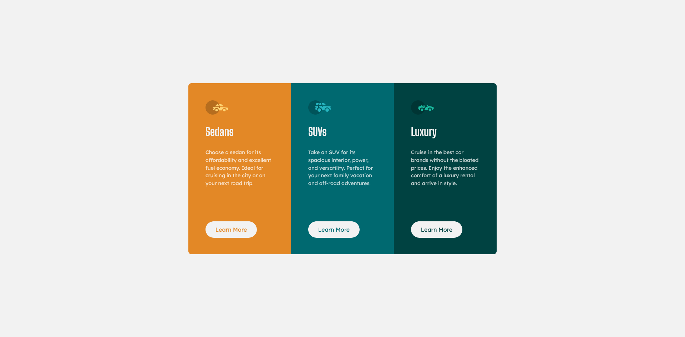
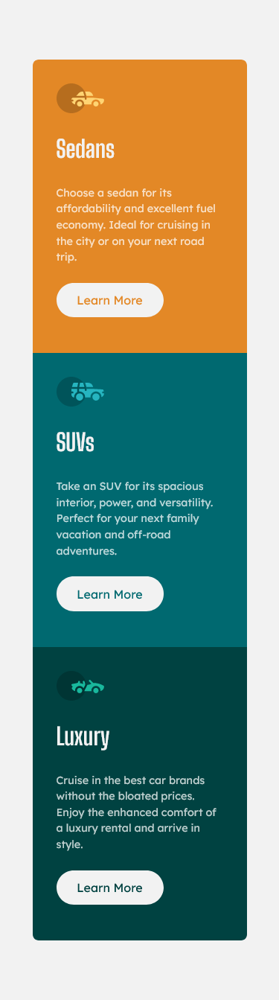

# Frontend Mentor - 3-column preview card component solution

This is a solution to the [3-column preview card component challenge on Frontend Mentor](https://www.frontendmentor.io/challenges/3column-preview-card-component-pH92eAR2-). Frontend Mentor challenges help you improve your coding skills by building realistic projects. 

## Table of contents

- [Overview](#overview)
  - [The challenge](#the-challenge)
  - [Screenshot](#screenshot)
  - [Links](#links)
- [My process](#my-process)
  - [Built with](#built-with)
  - [What I learned](#what-i-learned)
  - [Continued development](#continued-development)
  - [Useful resources](#useful-resources)

- [Acknowledgments](#acknowledgments)

## Overview

### The challenge

Users should be able to:

- View the optimal layout depending on their device's screen size
- See hover states for interactive elements

### Screenshot

### Links

- Solution URL: [Add solution URL here](https://your-solution-url.com)
- Live Site URL: [Add live site URL here](https://your-live-site-url.com)

## My process

### Built with

- Semantic HTML5 markup
- CSS custom properties
- Flexbox
- Mobile-first workflow

### What I learned

1. Always use CSS reset
2. 320px without horizontal scroll to meet WCAG level AA
3. You may not need to use media query(like the qr-code challange), with the help of max-width or grid auto-fill minmax, .etc.  
2. Use em/rem for media query
3. No explicit px for font-size
4. CUBE CSS, Utopia, progressive enhancement (still don't know how to implement)
8. Don't spend all of your time looking for best practices
4. CSS is complex

### Continued development

1. Semantics & a11y
2. Arrange CSS

### Useful resources

- [FED Mentor](https://fedmentor.dev/) -  Knowledge for newbies
- [CUBE CSS](https://cube.fyi/) - A CSS methodology

## Acknowledgments

Thanks BRIVAL-M for comment and his good semantic HTML and neat CSS code with BEM, 
Luis Jimenez's comment and much help from FEM Discord server, especially kind gracesnow.

