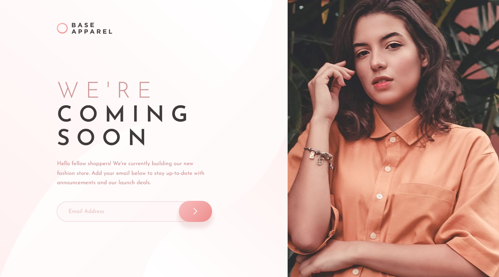
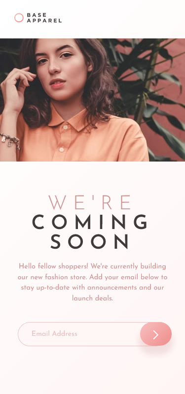

# Frontend Mentor - Base Apparel coming soon page solution

This is a solution to the [Base Apparel coming soon page challenge on Frontend Mentor](https://www.frontendmentor.io/challenges/base-apparel-coming-soon-page-5d46b47f8db8a7063f9331a0). Frontend Mentor challenges help you improve your coding skills by building realistic projects. 

## Table of contents

- [Overview](#overview)
  - [The challenge](#the-challenge)
  - [Screenshot](#screenshot)
  - [Links](#links)
- [My process](#my-process)
  - [Built with](#built-with)
  - [What I learned](#what-i-learned)
  - [Continued development](#continued-development)
  - [Useful resources](#useful-resources)

## Overview

### The challenge

Users should be able to:

- View the optimal layout for the site depending on their device's screen size
- See hover states for all interactive elements on the page
- Receive an error message when the `form` is submitted if:
  - The `input` field is empty
  - The email address is not formatted correctly

### Screenshot

### Links

- Solution URL: [Add solution URL here](https://your-solution-url.com)
- Live Site URL: [Add live site URL here](https://your-live-site-url.com)

## My process

### Built with

- Semantic HTML5 markup
- CSS custom properties
- Flexbox
- CSS Grid
- Mobile-first workflow
- Cosntraint Validaiton API

### What I learned

I spent almost 8 hours on this challenge.  
- I pixel perfect the page on 1440 x 800, 375 x 800 like the screenshot size.
- Since I don't want the hero image to be enlarged, I center the grid item when width is too big so that the items would not be on the side, causing emptiness in the middle.

Although I'm still not happy with the results, I do learned something through the process.

1. Plan both mobile and desktop layout before writing CSS, or you may need to adjust your HTML: After finishing the mobile layout I realize that `picture` element shouldn't be inside of `main` if I want to use grid, so I pull it out and rewrite part of the CSS.
2. Don't blindly try and error, think more comprehensively about what's the problem now then start coding. I found myself constantly entering some self-driving mode like just adjusting some padding/margin/line-height repeatedly and that cost me a lot of time.
3. Don't try to pixel perfect too much. Figure out the order/relationship to adjust components or something may happen like
    - When you fix this margin,  other element you just adjusted move
    - When you adjust the line-height, find out it's actually about the font-size
4. Be careful about using `outline: none` and `visibility: hidden`. The former causes issue for keyboard users and the latter causes issue for screen readers. In this challenge I use the latter for the error icon so I think it's fine.
5. Style the color of `input` would style placeholder too in FireFox, but not in Chrome. The placeholder of FireFox has default opacity, but not in Chrome
  => Add `input::placeholder` to style `color` and `opacity`, making the page look the same in both browsers.
    > Check the result using different browsers while developing next time.

Despite it's simple, I finally write some js.  
I wish I could write tons in the future.

### Continued development

1. See other's solution
2. Adjust layout/media query
3. Improve wherever I can

### Useful resources

- [Constraint Validation API](https://developer.mozilla.org/en-US/docs/Learn/Forms/Form_validation#the_constraint_validation_api) - Custom your error message for form validaiton.
