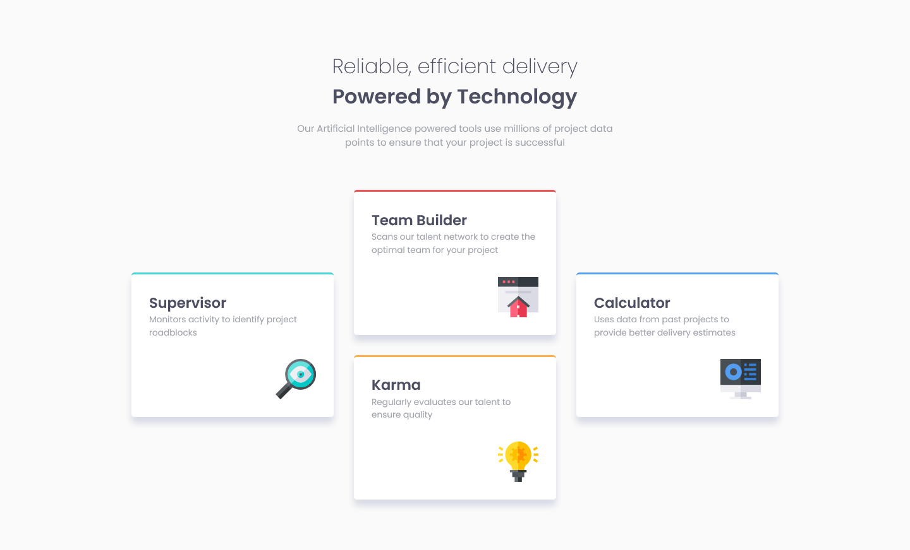
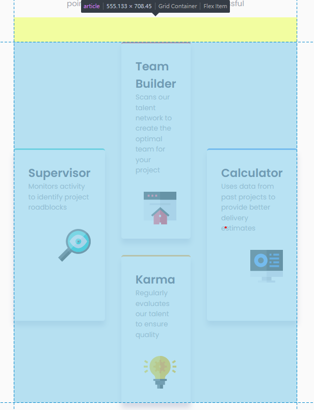

# Frontend Mentor - Four card feature section solution

This is a solution to the [Four card feature section challenge on Frontend Mentor](https://www.frontendmentor.io/challenges/four-card-feature-section-weK1eFYK). Frontend Mentor challenges help you improve your coding skills by building realistic projects. 

## Table of contents

- [Overview](#overview)
  - [The challenge](#the-challenge)
  - [Screenshot](#screenshot)
  - [Links](#links)
- [My process](#my-process)
  - [Built with](#built-with)
  - [What I learned](#what-i-learned)
  - [Useful resources](#useful-resources)


## Overview

### The challenge

Users should be able to:

- View the optimal layout for the site depending on their device's screen size

### Screenshot




### Links

- [Solution URL](https://github.com/devusexu/Frontend-Mentor/tree/main/four-card-feature-section-master)
- [Live Site URL](https://devusexu.github.io/Frontend-Mentor/four-card-feature-section-master/)

## My process

### Built with

- Semantic HTML5 markup
- CSS custom properties
- Flexbox
- CSS Grid
- Mobile-first workflow

### What I learned

I use grid for desktop layout this time, but I'm still not familiar with it.  
I think setting `repeat(3, 1fr)` for cards would span the spaces equally, while the truth is it becomes kinda weird like the screenshot below.



The reason is that 1fr is actually shorthand for `minmax(auto, 1fr)`  
It takes the *available* space.  
While I didn't set explicit width for this article container so there is no available space.  
The three cards will just use auto instead, which is the minimum width for the h2 title to fit in.   
For example I changed `Team Builder` to `TeamBuilder`, it took more space than supervisor now since all characters of a word needs to be on the same line.  
I also calculate the width of each card, they're all the width of the header plus left and right paddings, which means there are no extra spaces.

```css
  article {
    display: grid;
    /* 
      fr won't take equal spaces; big explicit width can solve this issue
      like using 
        width: 80rem;  
        grid-template-columns: repeat(3, 1fr);
      each fr would then take the same width
    */
    grid-template-columns: repeat(3, 20rem);
    grid-template-areas: 
      ". team-builder ."
      "supervisor team-builder calculator"
      "supervisor karma calculator"
      ". karma ."
    ;
  }
```

### Useful resources

- [Equal width columns in CSS Grid](https://stackoverflow.com/questions/47601564/equal-width-columns-in-css-grid) - This helped me understanding fr unit in grid


