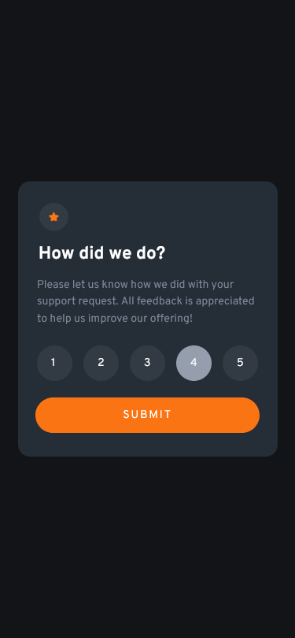
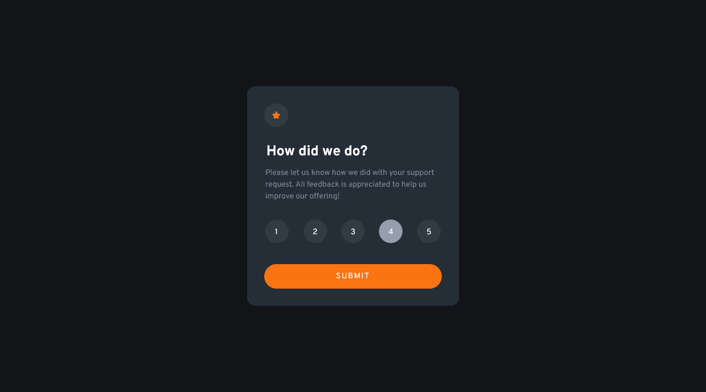
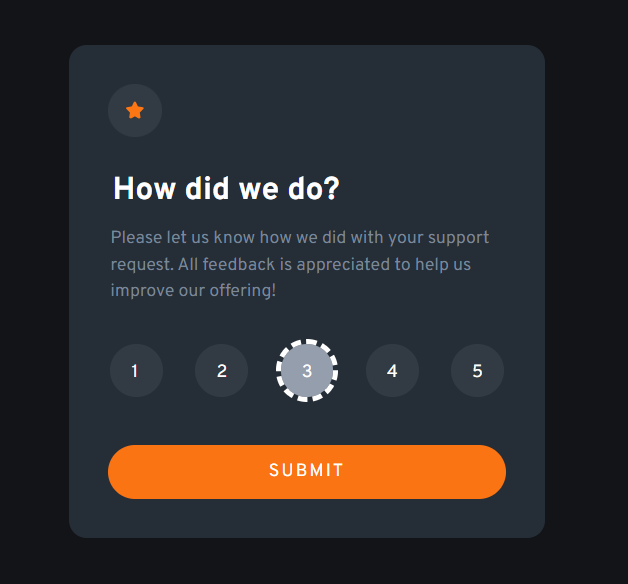
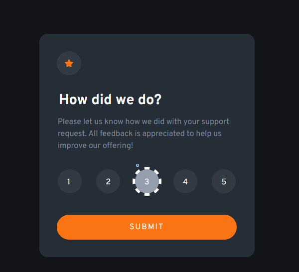

# Frontend Mentor - Interactive rating component solution

This is a solution to the [Interactive rating component challenge on Frontend Mentor](https://www.frontendmentor.io/challenges/interactive-rating-component-koxpeBUmI). Frontend Mentor challenges help you improve your coding skills by building realistic projects. 

## Table of contents

- [Overview](#overview)
  - [The challenge](#the-challenge)
  - [Screenshot](#screenshot)
  - [Links](#links)
- [My process](#my-process)
  - [Built with](#built-with)
  - [What I learned](#what-i-learned)
  - [Continued development](#continued-development)

## Overview

### The challenge

Users should be able to:

- View the optimal layout for the app depending on their device's screen size
- See hover states for all interactive elements on the page
- Select and submit a number rating
- See the "Thank you" card state after submitting a rating

### Screenshot





### Links

- [Solution URL](https://github.com/devusexu/Frontend-Mentor/tree/main/interactive-rating-component-main)
- [Live Site URL](https://devusexu.github.io/Frontend-Mentor/interactive-rating-component-main/)

## My process

### Built with

- Semantic HTML5 markup
- CSS custom properties
- Flexbox
- Mobile-first workflow
- JavaScript

### What I learned

To improve a11y, I add explicit border to focused state for both label and button.

Using `appearance: none` for radio input; input:checked style gone in Chrome but remained in Firefox.

Chrome:  
  

Firefox(see the blue dot):  


Other learning:
1. `aria-live` should be used at the parent of the `display: none` element to be read out by screen reader. Check [Testing ARIA-LIVE
with display:none and innerHTML](https://www.davidmacd.com/blog/test-aria-live-display-none.html)
2. Screen reader do read out "how did we do? radio button 5 checked" when an option is checked, but also other things like "grouping" for `fieldset`, "list" for `li` are being read out too.
1. Tab into radio group then check different option using arrow keys
2. Using SASS might improve developer experience with the nesting feature, because I wrote CSS like this
    ```css
      .thank-you img {
        ...
      }

      .thank-you h2 {
        ...
      }

      .thank-you p {
        ...
      }         

    ```
1. Don't focus on pixel perfection with gap/padding/margin too much, focus on the implementation and learning


### Continued development

Should I use more classes or just use lots of combinators like now?