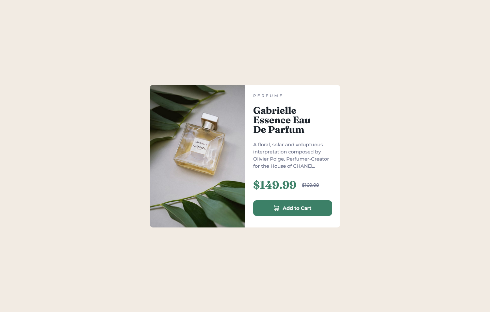
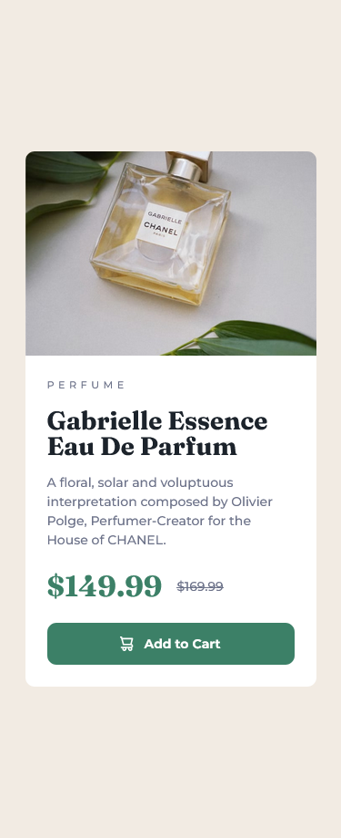

# Frontend Mentor - Product preview card component solution

This is a solution to the [Product preview card component challenge on Frontend Mentor](https://www.frontendmentor.io/challenges/product-preview-card-component-GO7UmttRfa). Frontend Mentor challenges help you improve your coding skills by building realistic projects. 

## Table of contents

- [Overview](#overview)
  - [The challenge](#the-challenge)
  - [Screenshot](#screenshot)
  - [Links](#links)
- [My process](#my-process)
  - [Built with](#built-with)
  - [What I learned](#what-i-learned)
  - [Continued development](#continued-development)
  - [Useful resources](#useful-resources)
- [Author](#author)
- [Acknowledgments](#acknowledgments)


## Overview

### The challenge

Users should be able to:

- View the optimal layout depending on their device's screen size
- See hover and focus states for interactive elements

### Screenshot




### Links

- [Solution URL](https://github.com/devusexu/Frontend-Mentor/tree/main/product-preview-card-component-main)
- [Live Site URL](https://devusexu.github.io/Frontend-Mentor/product-preview-card-component-main/)


## My process

### Built with

- Semantic HTML5 markup
- CSS custom properties
- Flexbox
- CSS Grid
- Mobile-first workflow


### What I learned

Estimate: 140 mins  
Reality: 219 mins
  - coding: 26 + 35 + 35 + 35 + 35 + 13 = 179 mins
  - writing docs & submit: 40 mins  

wat the hail, it takes so long! 


====================   

1. want flexbox row items to have same height => use grid instead
2. use [Accessible color palette generator](https://venngage.com/tools/accessible-color-palette-generator) to pick up similar colors for button interactive styles (it list the contrast too, cool!)
3. add ```overflow:hidden``` if border-radius doesn't work
4. use new elements for RWD image
    - figure
    - picture
5. almost forgot I use ```transition: all .2s ease-out;``` , it happens when property changes. Cool!


### Continued development

1. How to name color variables? primary, neutral, cornflower, ...?
2. When to use %? I use rem/em in most cases and px for margin/padding
3. I put everything in ```figcaption```, is that right? Because I think all of the information is about the picture, so they are all caption.
4. Is there too much explicit width? including max-width and max-height
4. Any better ways to write HTML & CSS: semantics, too many div?, class usage, CSS code refactoring

### Useful resources

- [Accessible color palette generator](https://venngage.com/tools/accessible-color-palette-generator) - accessible palette to pick colors
